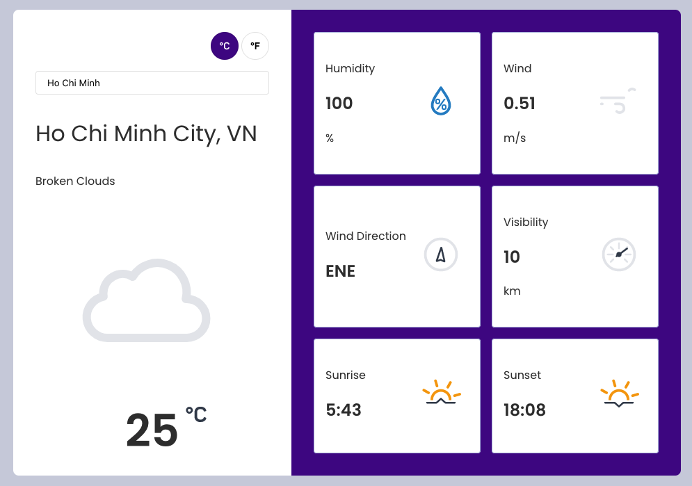

# Vue Weather Application



## Getting Started

Running in localhost:5000

```
$ pnpm dev
```

## Materials

- [Vue - HeadlessUI](https://headlessui.dev/vue/)
- [Weather Icons Animation](https://bas.dev/projects/weather-icons)
- [Flow Typeface](http://danross.co/flow/)

## License

MIT © [Dang Van Thanh](http://dangthanh.org)
